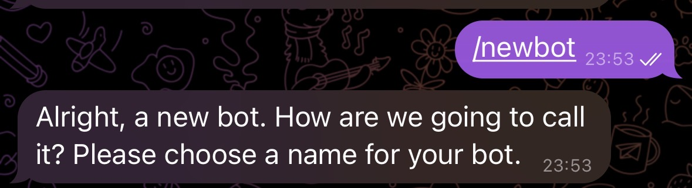
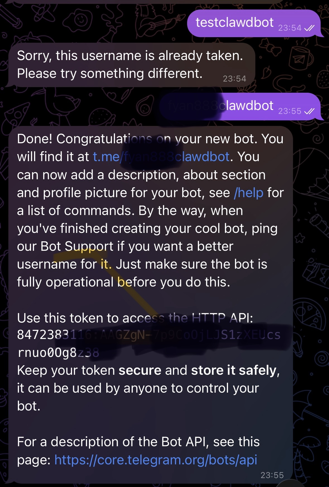
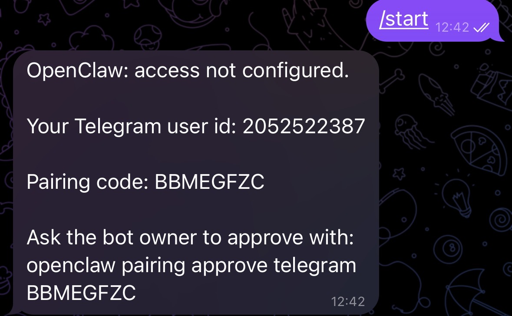
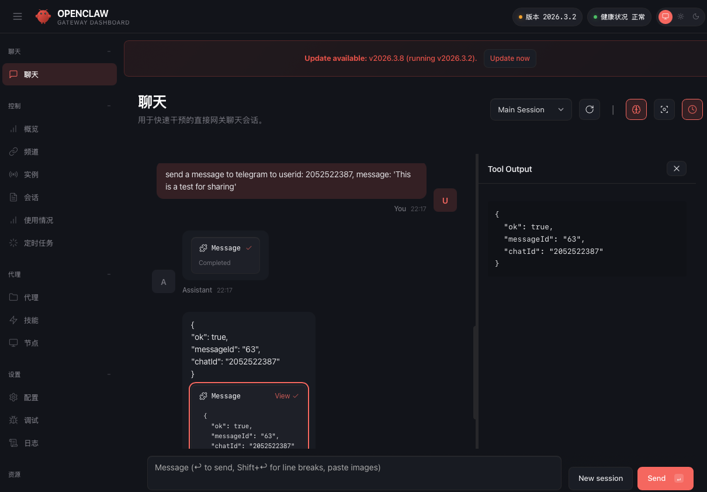
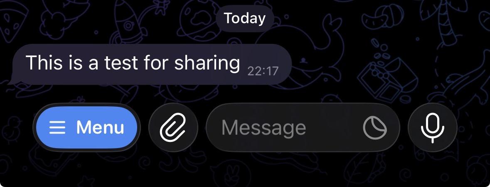

# OpenClaw 安装启动

> 安装启动 OpenClaw 服务

安装命令
确保你的Node在v22以上。
```bash
nvm install 24
nvm use 24
```
然后
```bash
npm install -g openclaw
```

> 结合Ollama(不是必须)

确保你的Ollama是最新的版本，还有，可以使用QWen模型，也可以使用其它模型。
可以使用8b体验一下。16G的建议使用2b。
不要使用deepseek，基本会失败。
建议使用这里的模型：[https://ollama.com/search?c=tools](https://ollama.com/search?c=tools)
```bash
ollama launch openclaw
```

> 配置openclaw

```bash
openclaw configure
openclaw onboard
openclaw gateway restart
```

记得选择local并指向我的ollama模型

> 使用cloud的token

如果不想使用本地的模型，可以试试阿里云或者[Kimi bot](https://www.kimi.com/bot)。Kimi收费是199一个月。
可以使用的：[阿里云百炼](https://bailian.console.aliyun.com/cn-beijing/?spm=a2c4g.11186623.0.0.26244135VEiABg&tab=model#/api-key)

> 打开openclaw的URL

打开下面的地址
[http://127.0.0.1:18789/chat](http://127.0.0.1:18789/chat)

> 与Telegram结合

打开BotFather，
/start
/newbot
/mybots
打开我的机器人，然后
/start





>> 在openclaw.json里面的配置
```json
"channels": {
    "telegram": {
      "enabled": true,
      "dmPolicy": "allowlist",
      "botToken": "847xxxx31xx:xxxxxxxxxxxxxxxxxxxx",
      "groupPolicy": "allowlist",
      "streaming": "partial",
      "allowFrom": ["2052xxxxxx"]
    }
  }
```

> 测试发送消息



